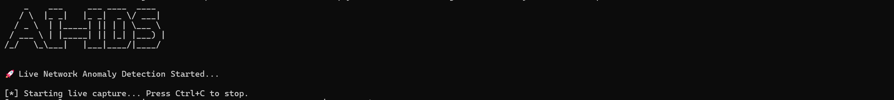

# AI-IDS

**AI-IDS** is a real-time network intrusion detection system powered by **Artificial Intelligence**. It captures live network traffic, extracts features from packets, and predicts whether the traffic is normal or anomalous using a trained deep learning model.

---

## Screenshot



---

## Features

- Real-time live network traffic capture using `Scapy`.
- AI-powered anomaly detection with a pre-trained TensorFlow model.
- Dynamic ASCII console logo at startup.
- Logs all traffic and anomalies separately for analysis.
- Clean console output showing prediction scores for each packet.

---

## Installation

1. Clone the repository:

```bash
git clone https://github.com/yourusername/AI-IDS.git
cd AI-IDS
pip install pandas numpy scikit-learn tensorflow scapy pyfiglet
```

2. Run the IDS
   ```bash
   python3 ids.py
   ```
